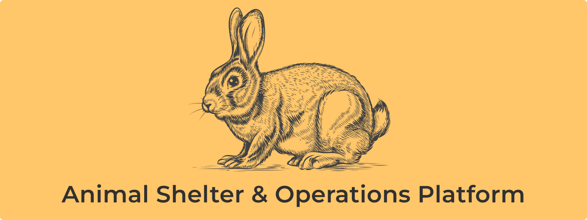

<p align="center">
  
</p>

<p align="center">
  <b><a href="https://animal-shelter-zeta.vercel.app/">🌐 Live Demo</a></b> | 
  <b><a href="docs/screenshots.md">📸 Screenshots</a></b> | 
  <b><a href="#getting-started">📖 Setup</a></b> | 
  <b><a href="contributing.md">🤝 Contributing</a></b>
</p>

---

This is an open-source, full-featured web application designed to be a comprehensive, end-to-end platform for animal shelters and rescue organizations. It moves beyond a simple pet listing site to provide a robust operational backbone for managing the entire lifecycle of an animal, from intake to outcome.

The platform features a public-facing portal for potential adopters and a powerful, permission-controlled dashboard for staff and volunteers to manage all aspects of shelter operations with a focus on data integrity and workflow automation.

## Table of Contents

- [Core Features](#core-features)
  - [Animal Lifecycle Management](#animal-lifecycle-management)
  - [Comprehensive Animal Profiles](#comprehensive-animal-profiles)
  - [Adoption Application Workflow](#adoption-application-workflow)
  - [User & Data Integrity](#user--data-integrity)
- [Tech Stack](#tech-stack)
- [Environment Variables](#environment-variables)
- [Admin Dashboard Access](#admin-dashboard-access)
- [Getting Started](#getting-started)
- [Running the App](#running-the-app)
- [Credits](#credits)

## Core Features

The application is built around distinct, interconnected modules that handle the complex needs of a modern animal shelter.

### Animal Lifecycle Management

The system meticulously tracks an animal's entire journey through the shelter.

- **Intake Processing**: Handles various intake scenarios, including **owner surrenders**, **strays**, and **transfers** from partner organizations. It captures detailed information about the animal's origin and the people involved.
- **Re-Intake Workflow**: Provides a dedicated process for animals returning to the shelter. It automatically reactivates archived animal profiles, resets their status to `DRAFT`, and logs a new intake event, preserving the animal's complete history.
- **Outcome Management**: Manages all possible outcomes, including **adoptions**, **transfers out**, and **return-to-owner**. The system ensures data consistency with atomic operations. For example, processing an adoption:
  1.  Archives the animal's public profile.
  2.  Sets the appropriate `archiveReason` (e.g., `ADOPTED_INTERNAL`).
  3.  Updates the winning adoption application's status to `ADOPTED`.
  4.  **Automatically rejects all other open applications** for that animal, preventing conflicts and saving administrative time.

### Comprehensive Animal Profiles

Each animal has a rich, detailed profile that serves as the central hub for all its information. Staff can manage:

- **Core Details**: Update fundamental information like name, species, breed, age, weight, photos, and microchip number.
- **Characteristics Tagging**: Assign filterable tags (e.g., "Good with Kids," "Housebroken," "Heartworm Positive") to help match animals with suitable adopters. The system intelligently handles adding and removing tags in a single operation.
- **Dynamic Assessments**: Conduct standardized assessments (e.g., behavioral evaluations, medical intake exams) using **customizable templates**. The application dynamically generates forms and validation based on the selected template, ensuring consistent data collection.
- **Notes & History**: Add categorized notes (`BEHAVIORAL`, `MEDICAL`, `GENERAL`) to an animal's record. A full history of an animal's journey, status changes, and key events is logged automatically.
- **Task Management**: Create, assign, and track tasks related to a specific animal, such as "Administer medication," "Schedule vet visit," or "Behavioral follow-up." Tasks have statuses, priorities, and optional due dates.

### Adoption Application Workflow

The platform includes a complete system for managing adoption applications for both applicants and staff.

- **Public Application Portal**: Potential adopters can browse published animals, "like" their favorites, and submit detailed adoption applications directly through the platform.
- **Applicant Dashboard**: Applicants can view their submitted applications, edit them (if still pending), or withdraw them. They can also reactivate a previously withdrawn application if the animal becomes available again.
- **Staff Review & Management**: Staff have a dedicated dashboard to review and manage all incoming applications. Key features include:
  - **Status Management**: Update an application's status (`REVIEWING`, `APPROVED`, `REJECTED`, etc.) with a required reason for the change, creating a clear audit trail.
  - **Atomic Status Changes**: Approving an application automatically changes the animal's listing status to `PENDING_ADOPTION`, making it unavailable for new applications and preventing double-adoptions. If that application is later withdrawn or rejected, the system automatically makes the animal available again by setting its status back to `PUBLISHED`.
  - **Internal Notes**: Staff can add private notes to an application during the review process.

### User & Data Integrity

The system is built with security and data consistency as top priorities.

- **Role-Based Access Control (RBAC)**: Actions are protected by a permission system (`RequirePermission`). This ensures that only authorized users (e.g., `STAFF`, `ADMIN`) can perform sensitive operations like updating animal records or managing applications.
- **Transactional Integrity**: Critical multi-step database operations are wrapped in **Prisma transactions**. This guarantees that all steps in a process (like an adoption or intake) either complete successfully or fail together, preventing the database from ever being left in an inconsistent state.
- **Soft Deletes**: Important records like notes and assessments are soft-deleted rather than being permanently erased, preserving historical data for auditing and potential restoration.

## Tech Stack

### Core Stack

- **Framework**: [Next.js](https://nextjs.org/) (App Router)
- **Language**: [TypeScript](https://www.typescriptlang.org/)
- **Backend**: [Node.js](https://nodejs.org/)
- **Database**: [PostgreSQL](https://www.postgresql.org/)
- **File Storage**: [Vercel Blob](https://vercel.com/docs/vercel-blob/)
- **ORM**: [Prisma](https://www.prisma.io/)
- **Authentication**: [Auth.js](https://authjs.dev/) (NextAuth)

### UI & Styling

- **Styling**: [Tailwind CSS](https://tailwindcss.com/)
- **Component Library**: [shadcn/ui](https://ui.shadcn.com/) (built on [Radix UI](https://www.radix-ui.com/))
- **Forms**: [React Hook Form](https://react-hook-form.com/) with [Zod](https://zod.dev/) for validation
- **Data Visualization**: [Recharts](https://recharts.org/)
- **File Uploads**: [Uppy](https://uppy.io/) with [Vercel Blob](https://vercel.com/storage/blob)
- **Containerization**: [Docker](https://www.docker.com/)

## Environment Variables

Add the following variables to your `.env` file. See `.env.example` for a full reference.

### Authentication

| Variable             | Required    | Description                                                                                                           |
| -------------------- | ----------- | --------------------------------------------------------------------------------------------------------------------- |
| `AUTH_SECRET`        | ✅ Required | Secret key for authentication. [See generation instructions below.](#generating-auth_secret)                          |
| `AUTH_GITHUB_ID`     | ⚪ Optional | GitHub OAuth client ID, from your [GitHub Developer settings](https://github.com/settings/developers).                |
| `AUTH_GITHUB_SECRET` | ⚪ Optional | GitHub OAuth client secret, from your [GitHub Developer settings](https://github.com/settings/developers).            |
| `ADMIN_PASSWORD`     | ✅ Required | Password for the default admin user, used when seeding the database. Also the password for all other seeded accounts. |

> **`AUTH_TRUST_HOST`** — Not in `.env.example`, but Auth.js supports `AUTH_TRUST_HOST=true` to trust the host header in development. This is typically set automatically on Vercel.

### Database

| Variable            | Required       | Description                                                                                                                                            |
| ------------------- | -------------- | ------------------------------------------------------------------------------------------------------------------------------------------------------ |
| `DATABASE_URL`      | ✅ Required    | Connection URL used by Prisma. For local dev, use your Docker values (see below). For production, replace with your provider's URL (e.g. Vercel/Neon). |
| `POSTGRES_USER`     | 🐳 Docker only | PostgreSQL username. Used by Docker Compose to initialize the container.                                                                               |
| `POSTGRES_PASSWORD` | 🐳 Docker only | PostgreSQL password. Used by Docker Compose to initialize the container.                                                                               |
| `POSTGRES_HOST`     | 🐳 Docker only | Set to `postgres` (the Docker Compose service name) for local dev.                                                                                     |
| `POSTGRES_DB`       | 🐳 Docker only | PostgreSQL database name. Used by Docker Compose to initialize the container.                                                                          |
| `POSTGRES_PORT`     | 🐳 Docker only | PostgreSQL port. Defaults to `5432`.                                                                                                                   |

### Storage

| Variable                | Required    | Description                                                      |
| ----------------------- | ----------- | ---------------------------------------------------------------- |
| `BLOB_READ_WRITE_TOKEN` | ✅ Required | Read/write token for Vercel Blob Storage (stores animal images). |

### Generating `AUTH_SECRET`

Run the following command to generate a secure secret key:

```bash
openssl rand -base64 32
```

- **macOS / Linux** — OpenSSL is usually pre-installed. Verify with `openssl version`.
- **Windows** — Install via the [OpenSSL website](https://www.openssl.org/) or Chocolatey: `choco install openssl`.

## Admin Dashboard Access

These credentials are created when you seed the database (`npx prisma db seed`).

### Admin

| Field    | Value                                                      |
| -------- | ---------------------------------------------------------- |
| Email    | `admin@example.com`                                        |
| Password | The value you set for `ADMIN_PASSWORD` in your `.env` file |

### Other Seeded Accounts

All non-admin accounts use the same password as `ADMIN_PASSWORD`.

| Email                      | Name            | Role      |
| -------------------------- | --------------- | --------- |
| `staff1@example.com`       | Olivia Chen     | Staff     |
| `staff2@example.com`       | Benjamin Carter | Staff     |
| `surrenderer1@example.com` | Jane Doe        | User      |
| `finder1@example.com`      | John Smith      | User      |
| `volunteer1@example.com`   | Sam Rivera      | Volunteer |

> **Live demo password:** `7dJbys5@?tMA`

## Getting Started

To run this project, you will need to have the following installed:

- [Node.js](https://nodejs.org/) (v18 or later)
- [Docker](https://www.docker.com/) and Docker Compose
- A free [Vercel](https://vercel.com/) account to use Vercel Blob for image storage.

### 1\. Initial Configuration

First, clone the repository and set up your environment variables.

1.  Clone the repository:

```sh
    git clone https://github.com/albdangarcia/animal-shelter.git
    cd animal-shelter
```

2.  Create your local environment file:

```sh
    cp .env.example .env
```

3.  **Fill out the `.env` file**:
    - Update the `POSTGRES_*` variables. The default values in `.env.example` are configured to work with the Docker setup below.
    - Set `ADMIN_PASSWORD` to a password of your choice. This will be the password for all seeded accounts.
    - Generate an `AUTH_SECRET` by running `openssl rand -base64 32`.
    - Log into your Vercel account, create a new Blob store, and get your `BLOB_READ_WRITE_TOKEN`. **This is required for all image upload/delete functionality.**

## Running the App

You have two main options for running the application, depending on your goal.

### Option 1: Recommended Local Development (Docker)

This is the fastest way for contributors to get the application running on their local machine. This setup uses **Docker** to run the Next.js app and the PostgreSQL database, but still connects to **Vercel Blob** for image storage.

1.  Build and run the Docker containers:

    ```sh
    docker compose build
    docker compose up
    ```

2.  Open your browser and navigate to `http://localhost:3000`.

> #### ⚠️ **A Note on Local Image Seeding**
>
> The database seeding script (`npx prisma db seed`) will populate the database with sample animals whose images are served from the local `/public` folder. This is done to provide a quick visual setup without requiring you to upload dozens of images manually.
>
> - **Functionality:** You can view these seeded animals perfectly.
> - **Limitation:** You **cannot delete** a seeded animal's image through the dashboard, as it only exists locally and not in your Vercel Blob store. Any **new animals and images you create** through the application UI will be uploaded to Vercel Blob correctly and will be fully manageable.

### Option 2: Deploying on Vercel (Fully Serverless)

This method mirrors the live production environment. It's ideal for testing the full serverless architecture or deploying your own version of the platform.

1.  **Fork the Repository** on GitHub.
2.  **Create a New Vercel Project** and connect it to your forked repository.
3.  **Set up Vercel Integrations**:
    - Add the **Vercel Postgres** integration to create a serverless database.
    - Add the **Vercel Blob** integration for image storage.
4.  **Connect Environment Variables**: Vercel will automatically provide `POSTGRES_URL` and `BLOB_READ_WRITE_TOKEN` from the integrations. Copy these and all other variables from your `.env` file into the **Environment Variables** section of your Vercel project settings.
5.  **Deploy**: Trigger a new deployment on Vercel. Your application will be live.

## Credits

Credit for the royalty-free images used in this project is given below:

- **Homepage dog image:** by [Brett Sayles](https://www.pexels.com/@brett-sayles/) (via Pexels)
- **All other pet images:** by [Pixabay](https://pixabay.com/)
- **Project logo (engraved rabbit):** Designed by macrovector / Freepik
