## Screenshots

Here are a few glimpses of the platform's public-facing and internal views:

### Public Portal
Screenshots showing the interface for potential adopters.

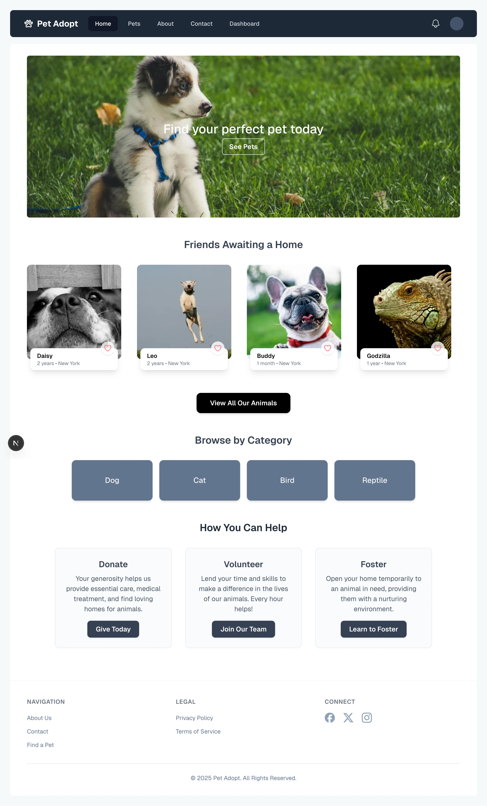

*The main landing page.*

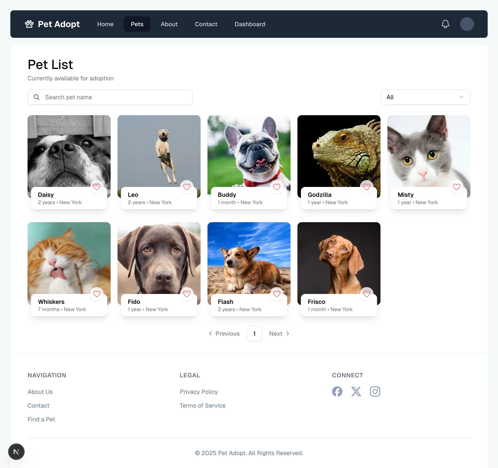

*Available pets for adoption.*

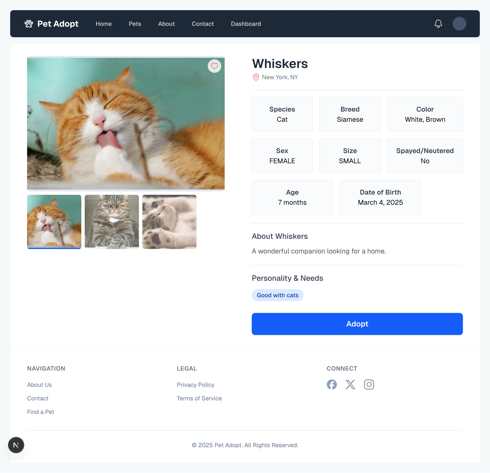

*Detailed pet information page.*

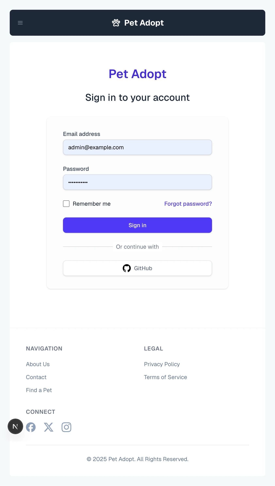

*Login page.*

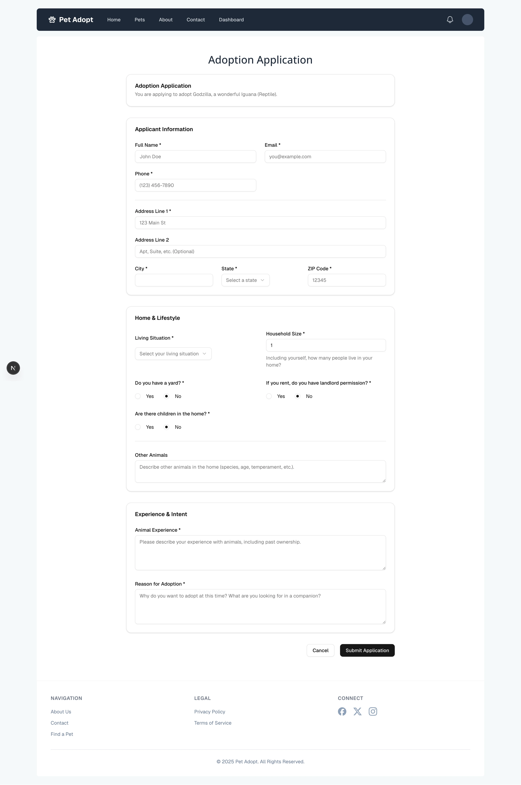

*Adoption application form*

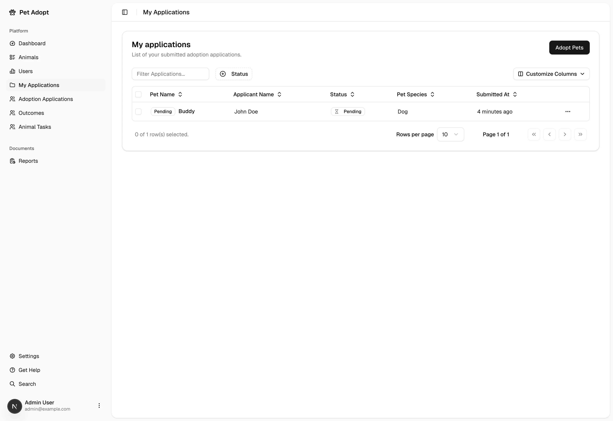

*My submitted adoption applications*

### Staff Dashboard
Screenshots of the internal operational management interface.

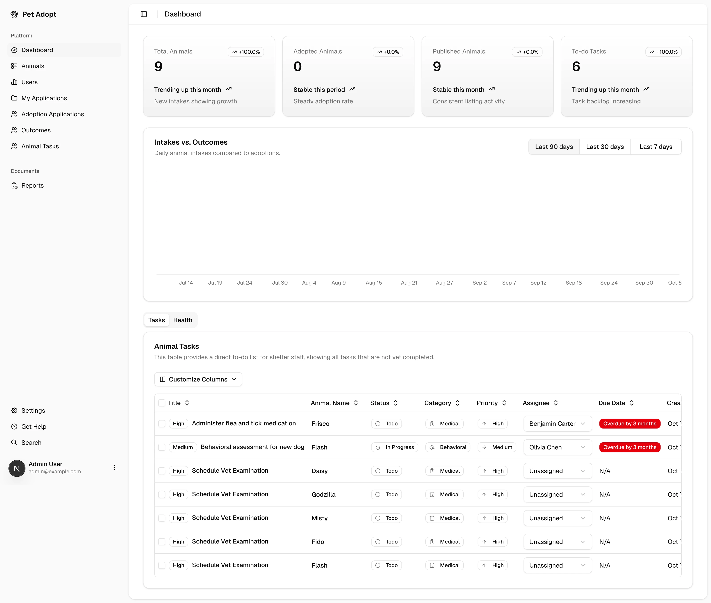

*Dashboard Analytics.*

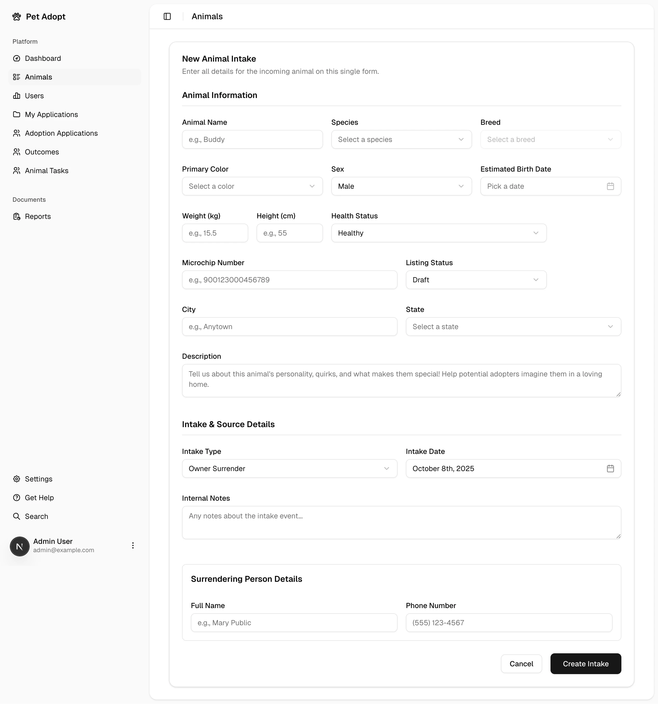

*Create a new animal form.*

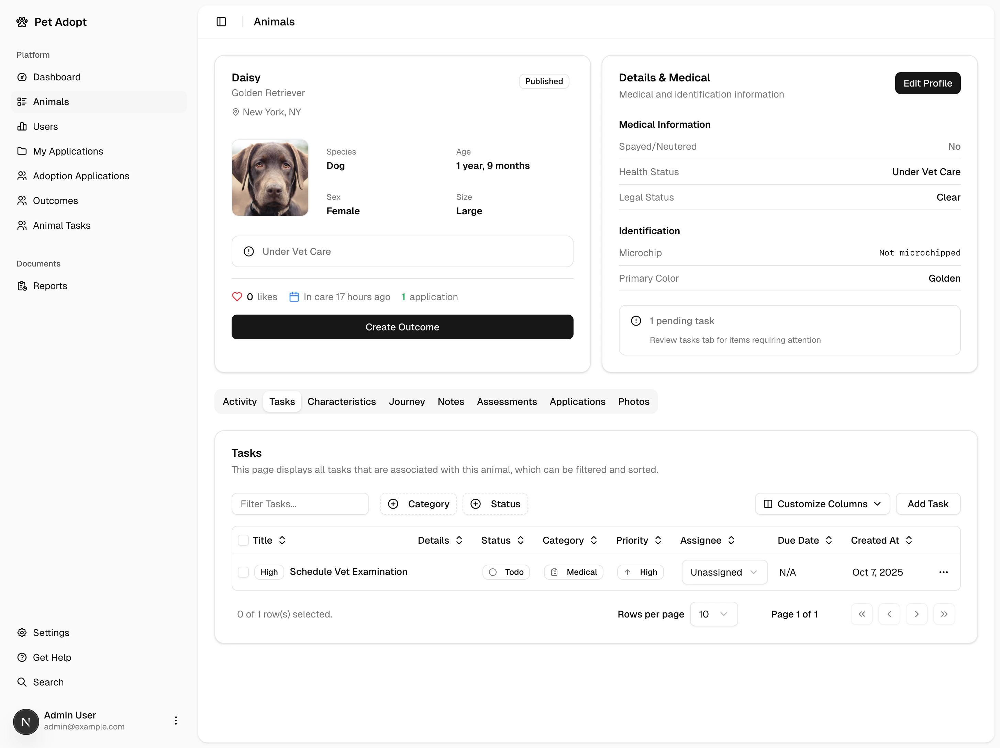

*Animal profile page.*

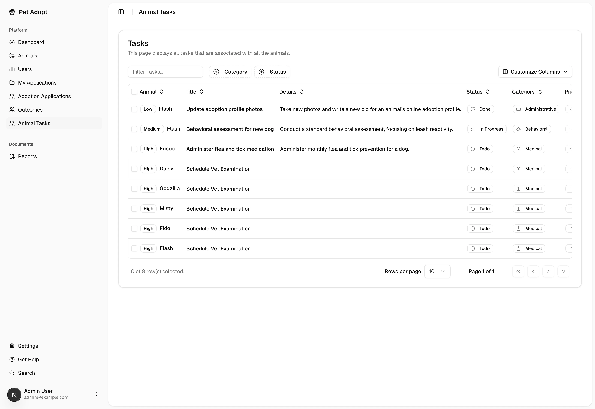

*All animal tasks.*

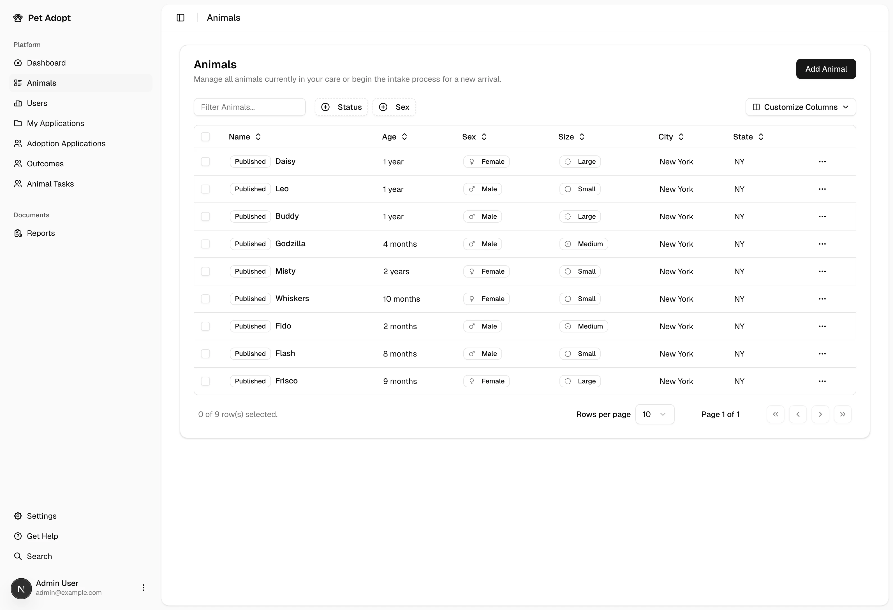

*Animal list table.*

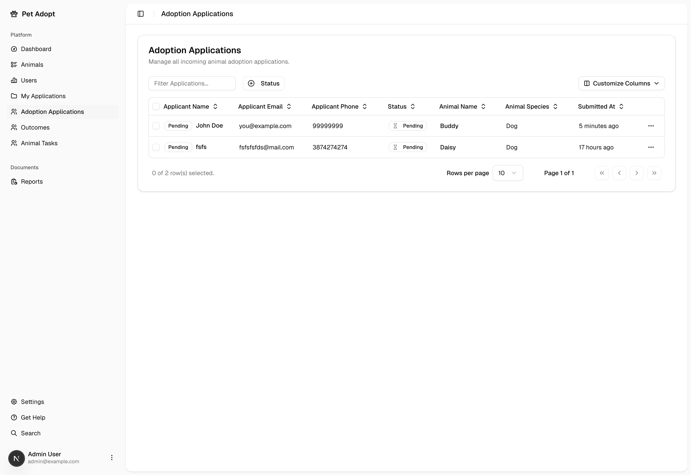

*Subbmited adoption applications from users.*

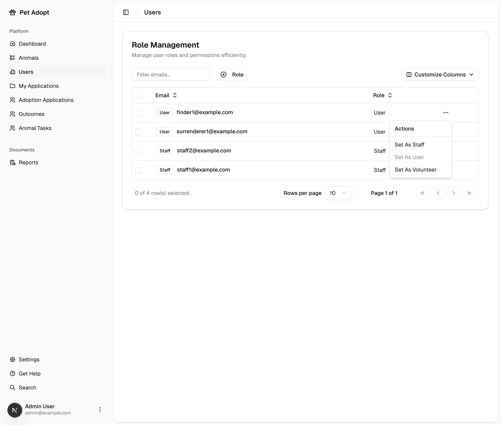

*Role management page.*